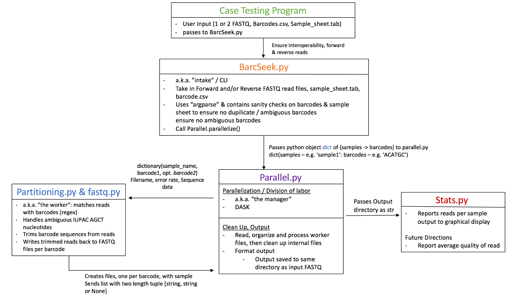

# BarcSeek 
BarcSeek in one sentence: A **General** Barcode Partitioning Tool for Demultiplexing Genomic Sequencing Data.

At BarcSeek, we believe all genomic barcoding schemes deserve to be analyzed. We developed this project to demultiplex a wide array of barcoding schemes and match them quickly and efficiently with their sequenced sample partners.

## Introduction
Wherever there is massive multiplexing in genomic sequencing data, a large amount of barcode data is generated as well. This barcode data is not necessarily encoded using the same schema (e.g. ChIP, single cell, RNAseq data). Our goal through this project was to take multiplexed genomic data and to label each transcript uniquely by partitioning the barcode data and assignng to the proper read, from many different FASTQ encoding schemes. 

This tool is efficiently implemented like many other demultiplexers, but it is distinguished from other demultiplexers by allowing and seemlessly handling inputs from many different sources and different barcode strategies. We understand and have worked with many different barcode formats and we have aimed to allow our program to handle the various barcoding strategies (e.g. barcode-UMI-barcode, barcode-UMI, and handle forward & reverse reads, among others).

## Who should use this project?
Someone who is looking for a genomic data dempultiplexer that can handle many different types of barcoding schemes.

This pipeline can be used to demultiplex:
- Single Cell
- RNAseq
- ChIPseq
- CLIP-Seq
- Small RNAseq

and other sequencing data sets. It can be used on single cell sequencing data as well.

## Project Architecture
### Graphical Pipeline Overview


The architecture for this project was conceptualized as "the manager-worker relationship" where the manager divides up the work to be done in an efficient way, the workers do the work, then the workers return the work to the manager to assemble and prepare the information for presentation back to the user.

More technically, once we have taken in the data and performed the proper validation via the command line interface (BarcSeek.py), parallel.py divides up the information into many files, taking advantage of the DASK parallel computing, data-analytics library. These files are then up among the workers. The partitioners use a regex to handle standard IUPAC degenerate nucleotide notations. The workers then return a number of parsed files back to the central processing script (the manager) to be assembled and returned to the user. 

### Test Case Approach: We developed sample test cases to test functionality of our code.
We simulated genomic data and stored it in hypothetical FASTQ files, one simulating a forward read (basic1.R1.fastq) and one simulating a reverse read (basic2.R1.fastq). Nucleotide lengths of the sample reads were:
- Sample barcodes: 6 nucleotides
- Degenerate sequences: 8 nucleotides
- Sequence of interest was 50 nucleotides. 

In essence the sequence information is the same, but the barcode and UMI information has been transposed. The schematic below provides additional information on how the test sequences were designed.

In the sample genomic data generation, the quality scores were sampled from phred33 scale, so its likely that some barcodes nucleotides may be low enough to count as an error or, at least, uncertain. We automated generation of these test fastqs. The code for generation of these test fastq files is linked [here](/test.cases/test.case.generator.R)

The contents of these files can be found [here](/test.cases).

## User Interface: The command line interface takes inputs from the user to pass through the program. 
The inputs required are: 
- filepath for the forward read FASTQ file (-f FORWARD FASTQ, required)
- filepath to the reverse FASTQ if necessary (-r REVERSE FASTQ, optional)
- filepath to the sample_sheet.tab file (-s SAMPLE SHEET, required)
- barcode.csv file (-b BARCODES, required)
- error rate (-e ERROR RATE, required but defaults to 1).
- number of lines to divide the FASTQ file into for one paritition to work on (-l NUMLINES, default is 40,000)

```usage: BarcSeek.py [-h] -f FORWARD FASTQ [-r REVERSE FASTQ] -s SAMPLE SHEET -b
                   BARCODES [-e ERROR] [-l NUMLINES]

                     -----------------------------------
                    < Pull DNA barcodes from FASTQ files >
                     -----------------------------------
                     /
     \ ______/ V`-, /
      }        /~~
     /_)^ --,r'
    |b      |b


optional arguments:
  -h, --help            show this help message and exit
  -f FORWARD FASTQ, --forward-fastq FORWARD FASTQ
                        Provide a filepath for the Forward FASTQ file.
                        [REQUIRED]
  -r REVERSE FASTQ, --reverse-fastq REVERSE FASTQ
                        Provide a filepath for the Reverse FASTQ file.
                        [OPTIONAL]
  -s SAMPLE SHEET, --sample-sheet SAMPLE SHEET
                        Provide a filepath for the Sample Sheet file.
                        [REQUIRED]
  -b BARCODES, --barcodes BARCODES
                        Provide a filepath for the Barcodes CSV file.
                        [REQUIRED]
  -e ERROR, --error ERROR
                        This is how many mismatches in the barcode
                        we allowed before rejecting.
                        [OPTIONAL, DEFAULT=1]
  -l NUMLINES, --numlines NUMLINES
                        We internally split your input file(s) into
                        many smaller files, after -l lines.
                        [OPTIONAL, DEFAULT=40000]
```
The command line interface also provides some sanity checks, including checking to ensure there are no ambiguous barcodes that could be misinterpreted and possibly assigned to the wrong sample read. The command line interface also uses regex to have the ability to check the barcode sequences to handle IUPAC degenerate nucleotide codes - [link](http://www.bioinformatics.org/sms/iupac.html).

### Parallelization: The parallelization code takes in the genomic data, divides it up, and passes the divided data to many workers.

### Partitioning: The partitioning code matches barcodes with reads, using the regex library.
This section can be conceptualized as the worker. If passed, this section can handle ambiguous nucleotides (as given by the IUPAC standard, e.g. Y = C or T). It trims barcode sequences from the reads, then writes trimmed reads back to a FASTQ file(s) titled by barcode.

### Output: The parallelization code then re-assembles the files into the proper matched barcode-sample output for the user. The output is provided as one or two files (depending on forward and reverse reads) in the directory of the original FASTQ files.

### Statistics and Quality Control: This counts number of reads in the output.

## Sample Input Files
- Sample FASTQ File: [link](/test.cases/FASTQ_short_example.txt). This file must be unzipped prior to analysis.
- Sample Barcode.csv: [link](barcodes_csv.txt). This file is maintained by the user.
   CSV file.
   
   Each line contains index,barcode
- Sample sample_sheet.tab: [link](Sample_sheet.txt). This file requires a header.
   Tab-separated file.
   
   Three columns:barcode1 barcode2 sample_name
   
   The barcodes are denoted by integers which reference the indexes from barcode.csv
   
   If a line only contains one barcode, we assume it will be found in FORWARD FASTQ.
   
   If a line contains two barcodes, we assume to find barcode1 in FORWARD FASTQ and barcode2 in REVERSE FASTQ.

## Software Dependencies
- Python 3.5 [link](https://www.python.org/downloads/release/python-350/)
- DASK: [link](http://dask.pydata.org/en/latest/)
- Regex: [link](https://pypi.python.org/pypi/regex/)
- NumPy [link](http://www.numpy.org)
- Matplotlib.pyplot [link](http://matplotlib.org)

## Resources
- Introduction to Sequencing: [link](https://www.illumina.com/content/dam/illumina-marketing/documents/products/illumina_sequencing_introduction.pdf)

## Future Directions
- Statistics and Quality Control. Further develop and add in average data quality.
- Uniform exception handling among all python files.
- Analyze information in UMIs. Currently this information is ignored.
- Managing whitespace considerations in CLI file & making code compatible with Python style guide. [(link)](http://legacy.python.org/dev/peps/pep-0008/)
- Add wiki-style section to provide use cases using various FASTQ files & barcoding strategies. [(link)](https://github.com/mojaveazure/angsd-wrapper/wiki)
- handle compressed / zipped FASTQ files. Currently our program will only process raw / unzipped FASTQ files.
- Add the ability to allow analysis on differences between forward and reverse reads (barcode1 and barcode2)

## Credits
Initial development took place at New York Genome Center, June 19-21, 2017 from a 5 person team from New York (4) and Boston (1) comprised of a couple computational biologists, a microbiologist, and a pathologist.

Another credit to icons8.com for our dog icon: [link](http://icons8.com) .
